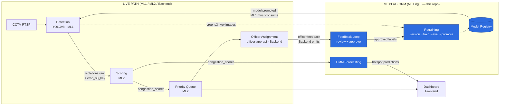

# ParkSight — Team Integration Package (ML Engineer 3)

Every contract between the ML platform (this repo) and the rest of the team, in both
directions. **PROVIDES** = others consume from ML Eng 3. **NEEDS** = ML Eng 3 consumes
from a teammate. All schemas are taken from the running code.

Conventions: REST under `/api/v1`, JSON bodies, `X-Role` header (demo) → JWT (prod).
Events are JSON on Kafka, every event carries `"schema_version": 1`.

---

## 0. Integration map (one glance)

| From → To | Contract | Type | Status |
|---|---|---|---|
| ML Eng 1 → ML Eng 3 | `violations.raw` + `violations.crop_s3_key` | event + table col | col missing |
| ML Eng 3 → ML Eng 1 | `model.promoted` | event | **no consumer yet** |
| ML Eng 2 → ML Eng 3 | `congestion_scores` | table | cadence unconfirmed |
| Backend → ML Eng 3 | `officer.feedback` | event | **producer not wired** |
| Backend → ML Eng 3 | table migrations, Kafka topics, S3, JWT | infra | pending |
| ML Eng 3 → Frontend | forecast / review / feedback / retraining REST | API | ready |
| ML Eng 3 → Frontend/Dashboard | `hotspot.predictions` | event | ready (no-op in demo) |

---

## 1. Contracts for ML ENGINEER 1 (Detection)

### 1a. NEEDS — `violations.crop_s3_key` (table column)
ML Eng 3's retraining needs the image behind each violation. Add a column and write a
**blurred vehicle-only crop** to S3 (GDPR — see FINAL_AUDIT C1).
```sql
ALTER TABLE violations ADD COLUMN crop_s3_key VARCHAR;  -- e.g. frames/2026-06-19/cam_042/frm_9921_crop.jpg
```

### 1b. NEEDS — `violations.raw` (event, already produced) must include the crop key
```json
{ "event":"violation.detected", "violation_id":"v_88213", "camera_id":"cam_042",
  "zone_id":"zone_17", "vehicle_type":"car", "confidence":0.83,
  "coordinates":{"lat":12.97,"lng":77.59}, "crop_s3_key":"frames/2026-06-19/cam_042/frm_9921_crop.jpg",
  "timestamp":"2026-06-19T11:04:00Z" }
```
`vehicle_type` MUST be one of the frozen 7 classes: `car, motorcycle, auto_rickshaw, bus, truck, van, other`.

### 1c. PROVIDES → ML Eng 1 — `model.promoted` (event ML Eng 1 must CONSUME)
**This is the loop's last hop and is currently unwired.** When ML Eng 3 promotes a new
champion, it emits this; detection-service must consume it and hot-reload the weights.
```json
{ "event":"model.promoted", "schema_version":1,
  "model_version":"yolov8_20260619_120000",
  "weights_uri":"s3://parksight-models/yolov8_20260619_120000/best.pt",
  "metrics":{"map50":0.91,"map5095":0.67,"precision":0.9,"recall":0.88} }
```
**Consumer contract:** on receipt, download `weights_uri`, load into the running detector,
keep the previous weights for instant rollback. Class index order is fixed (the 7 classes above).

---

## 2. Contracts for ML ENGINEER 2 (Scoring)

### 2a. NEEDS — `congestion_scores` (table ML Eng 3 reads for the HMM)
Schema ML Eng 3 reads (matches the backend schema doc):
```
congestion_scores(id, zone_id, timestamp, speed_drop_percent FLOAT,
                  violation_count INT, impact_score FLOAT)
```
**What ML Eng 3 needs confirmed:** the **write cadence** (assumed one row per zone per
~5–30 min) and that `impact_score ∈ [0,1]`. The HMM bins at 30 min; if your cadence
differs, tell ML Eng 3 so the binning matches. No code change needed from you beyond
populating the table at a steady interval.

### 2b. (optional) `zones.scored` event — not consumed by ML Eng 3 currently
Listed for completeness; ML Eng 3 reads the table, not this event.

---

## 3. Contracts for BACKEND

### 3a. NEEDS — emit `officer.feedback` (event)
When `/officer/status` receives `unresolvable` + a photo, officer-app-api must emit this.
ML Eng 3 currently emits it from its own endpoint as a stand-in.
```json
{ "event":"officer.feedback", "schema_version":1,
  "feedback_id":"f3a9c1e2b4d5", "violation_id":"v_88213", "camera_id":"cam_042",
  "zone_id":"zone_17", "officer_id":"off_009", "status":"unresolvable",
  "reason":"vehicle departed; was a tempo/van not a car", "proposed_class":"van",
  "photo_s3_key":"evidence/2026/06/19/f3a9c1e2b4d5.jpg",
  "crop_s3_key":"frames/2026-06-19/cam_042/frm_9921_crop.jpg",
  "timestamp":"2026-06-19T11:04:00Z" }
```
Required fields: `event, schema_version, feedback_id, violation_id, officer_id, status`.

### 3b. NEEDS — Alembic migrations for the 4 ML tables
`feedback_submissions`, `label_review_queue`, `dataset_versions`, `model_registry`,
`model_evaluations`, `retraining_runs`, `hmm_predictions` (DDL in `common/models.py`).
**Do NOT** re-create `congestion_scores` — ML Eng 3 reads ML Eng 2's existing table.

### 3c. NEEDS — Kafka topics + S3 buckets
Topics: `officer.feedback`, `model.promoted`, `hotspot.predictions`.
Buckets: `parksight-models`, `parksight-datasets`, `parksight-frames`.

### 3d. NEEDS — JWT replacing the `X-Role` stand-in
ML Eng 3's endpoints depend on `require_role(...)`. Swap the header check in `api/deps.py`
for JWT claim extraction; roles used: `officer, reviewer, operator, planner, admin`.

---

## 4. Contracts for FRONTEND (ML Eng 3 PROVIDES — all ready)

Base `http://<host>:8001/api/v1`, `X-Role` header. Full version in `FRONTEND_HANDOFF.md`.

### 4a. Forecast — `POST /forecast/hotspots` (operator/planner/admin)
**Response:**
```json
{ "zones":[ {"zone_id":"zone_04","current_state":3,"current_state_name":"critical",
  "predicted_state":3,"predicted_state_name":"critical","hotspot_probability":0.92,
  "risk_score":0.92,"escalation_probability":0.0,"insufficient_history":false,
  "for_timestamp":"2026-06-19T18:30:00+00:00","explanation":"Zone zone_04 is in a 'critical' regime ... 92% ..."} ] }
```

### 4b. Forecast heatmap — `GET /forecast/heatmap`
```json
{ "horizon_minutes":30,
  "zones":[ {"zone_id":"zone_04","risk_score":0.92,"hotspot_probability":0.92,"state":"critical"} ] }
```
Color: `risk≥0.66` red, `≥0.33` orange, else green. Join `zone_id` → PostGIS boundary.

### 4c. Submit feedback — `POST /officer/feedback` (officer)
**Request:** `{"violation_id":"v_88213","officer_id":"off_009","status":"unresolvable","proposed_class":"van","reason":"..."}`
**Response:** `{"feedback_id":"f3a9c1e2b4d5","status":"unresolvable","next_action":"upload_evidence"}`
Then `POST /officer/feedback/{id}/evidence` (multipart `file`) → `{"feedback_id","photo_s3_key","event"}`.

### 4d. Review console — `GET /review/queue?status=pending` (reviewer)
Returns `ReviewItem[]`; `POST /review/queue/{id}/approve` body `{"class_id":5,"bbox":{"cx":0.5,"cy":0.5,"w":0.6,"h":0.6}}` → updated `ReviewItem`.

### 4e. Retraining status — `GET /ml/retraining/status` (reviewer/operator/admin)
`{"approved_since_last_retrain":23,"threshold":50,"due":false,"last_retrain_started":"..."}`

### 4f. PROVIDES — `hotspot.predictions` (event for the predictive overlay)
```json
{ "event":"hotspot.predictions","schema_version":1,"horizon_minutes":30,
  "zones":[ {"zone_id":"zone_04","risk_score":0.92,"hotspot_probability":0.92,"predicted_state_name":"critical"} ] }
```
**Polling:** forecast every 30–60s; review queue every 15–30s. Realtime overlay: subscribe to this topic via notification-service WS in prod.

---

## 5. Single-page architecture diagram


Red-labeled edges (`model.promoted`, `officer.feedback`, `crop_s3_key`) are the **unwired
integration points**. Everything inside the ML PLATFORM box is built and tested.

---

## 6. 3-minute technical walkthrough (present tomorrow)

> *(0:00)* "ParkSight detects illegal parking from CCTV and turns it into a ranked,
> predictive enforcement signal. I built the **learning brain** — the part that makes it
> get smarter every week and forecast jams before they happen.
>
> *(0:25)* The live path is event-driven over Kafka: detection runs YOLOv8 and emits
> violations; scoring computes a congestion impact per zone; the queue ranks zones;
> officers are dispatched. My three subsystems sit beside that and close two loops.
>
> *(0:55) — Forecasting.* My HMM reads the congestion time-series and learns four hidden
> traffic regimes — calm, building, congested, critical — unsupervised. *(show
> regimes_timeline)* Here it is segmenting a real day. From the current regime and the
> learned transition matrix, I forecast each zone's hotspot risk for the next 30 minutes.
> *(show risk_ranking)* Right now, heading into evening rush, zones 3, 4, 5 are critical
> at 0.92 — and it explains why, in plain language. That's pre-staging: officers go where
> the jam *will* be.
>
> *(1:45) — Learning loop.* When an officer hits a violation the model got wrong, they
> mark it unresolvable and upload a photo. That becomes a review task; ML Engineer 1
> corrects the label; the corrected sample is written straight into the training set.
> *(show demo-feedback)* At fifty corrections, my pipeline automatically retrains YOLOv8 —
> versioning the exact dataset by content hash, evaluating it, and promoting the new model
> **only if it beats the current one and regresses no class**. The promotion fires a
> `model.promoted` event that detection hot-reloads. Bad detection in, better model out.
>
> *(2:40)* Everything I'm showing is running and tested — 22 passing tests. The detection,
> scoring, and dashboard are my teammates' services; the contracts between us are defined
> and documented. What you're seeing is the intelligence layer that makes ParkSight a
> system that improves itself."

---

## 7. Final blockers, ranked by submission risk

| # | Blocker | Owner | Demo impact | Submission risk | Action (12h) |
|---|---|---|---|---|---|
| 1 | **First-time live cross-service integration on stage** | Team | Could break the demo | **Critical** | Do NOT attempt; demo ML3 standalone (runs locally). Only combine if already tested. |
| 2 | **Demo machine not pre-staged** (weights, deps, clean state) | ML3 | Demo fails to start | **Critical** | `pip install -e ".[dev]"`, `make weights`, pre-clean DB/storage tonight; rehearse once. |
| 3 | **Overclaiming "fully integrated/production"** | Team | Fatal Q&A follow-up | **High** | Use JUDGE_QNA framing; state the real line (Q25/Q30). |
| 4 | `model.promoted` has no consumer (loop's last hop) | ML1 | None (demo local) | High (if probed) | Present as a defined contract; ML1 wires consumer if time permits. |
| 5 | `officer.feedback` producer not wired | Backend | None (demo stand-in) | Medium | Contract handed over; ML3 stand-in covers the demo. |
| 6 | `violations.crop_s3_key` missing | ML1 + Backend | None (demo uses synthetic) | Medium | Column DDL provided; needed for real retraining data. |
| 7 | Real `congestion_scores` cadence unconfirmed | ML2 | None (synthetic) | Medium | Confirm interval; HMM binning matches. |
| 8 | Infra (S3/Postgres/MSK) never executed | Backend | None (local) | Medium | Don't open live; explain via diagram. |
| 9 | Frontend widgets (overlay, review console) not built | Frontend | Visual polish | Low–Med | Use FRONTEND_HANDOFF; even partial overlay adds a lot. |
| 10 | JWT not wired (X-Role stand-in) | Backend | None | Low | Mention as the one-file swap it is. |

**Bottom line:** the top two risks are *operational* (don't break the live demo, pre-stage
the machine), not code. Your ML3 slice is integration-ready on the *contract* side — every
dependency is specified above with a schema and an example. Hand this doc to the team now.
