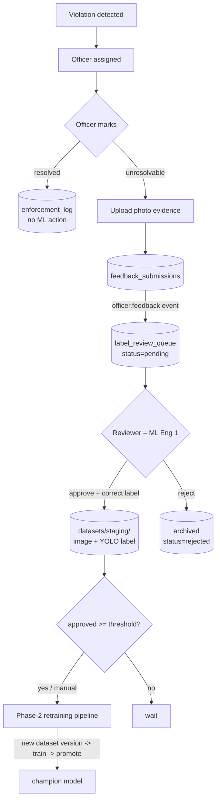
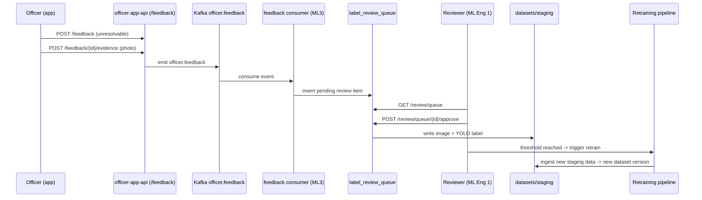

# Officer Feedback Loop

Turns officer field actions into approved training labels and feeds them back into
the Phase-2 retraining pipeline — the mechanism behind ParkSight's continuous learning.

## Workflow

## Event flow (who does what)

In demo mode (no broker) the consumer handler runs inline right after the event is
emitted, so the review item appears immediately — same handler the Kafka consumer uses.

## Database

**`feedback_submissions`** — every officer report. `status` ∈ {resolved, unresolvable};
only unresolvable + evidence feeds ML. Links to `violation_id`, stores `photo_s3_key`
and (production) `crop_s3_key`.

**`label_review_queue`** — one relabel task per unresolvable submission. `status` ∈
{pending, approved, rejected}. On approval, `corrected_class_id` + `corrected_bbox` are
written and `dataset_image_key` records where the sample landed in staging.

No change to existing ParkSight tables is required; these are additive (Backend owns the
Alembic migration in prod).

## API (all under `/api/v1`)

| Method | Path | Role | Purpose |
|---|---|---|---|
| POST | `/officer/feedback` | officer | submit resolved/unresolvable |
| POST | `/officer/feedback/{id}/evidence` | officer | upload photo → emit `officer.feedback` |
| GET | `/review/queue?status=pending` | reviewer | list relabel tasks |
| GET | `/review/queue/{id}` | reviewer | task detail |
| POST | `/review/queue/{id}/approve` | reviewer | approve → write to training staging |
| POST | `/review/queue/{id}/reject` | reviewer | archive |
| GET | `/ml/retraining/status` | reviewer/operator | approved-since-last-retrain vs threshold |
| POST | `/ml/retraining/trigger` | reviewer/admin | manual retrain (`full=true` = real training) |

Auth is an `X-Role` header stand-in for Backend's JWT (swap `api/deps.py` later).

## Retraining trigger

Fires when **approved relabels since the last successful run ≥ `FEEDBACK_RETRAIN_THRESHOLD`**
(default 50) **or** on a manual request. The count compares each approved item's
`decided_at` to the most recent run's `started_at` — no extra bookkeeping table.

## Continuous-learning guarantee

An approved label is physically written into `datasets/staging/` — the exact prefix
Phase-2 `ingest` reads. So the next dataset version provably contains the corrected
samples, and the content-hash version id changes. That's the closed loop:

**bad detection → officer flags it → reviewer corrects it → it's in the next model.**
