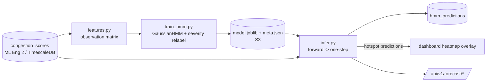
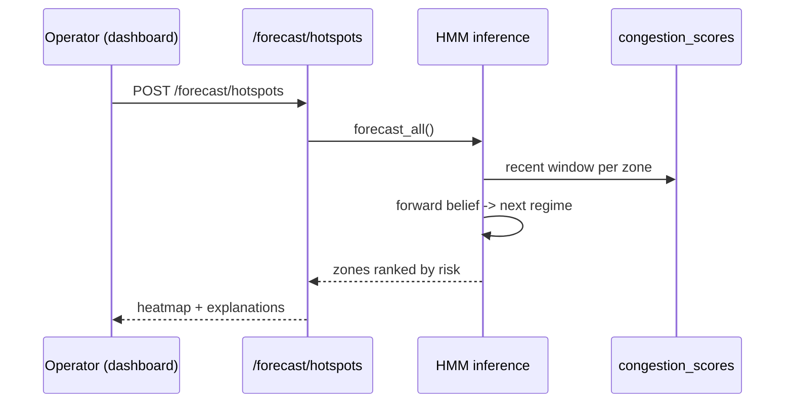

# HMM Predictive Pre-Staging (v2.0)

Forecasts each zone's **hotspot risk for the next 30 minutes** so officers can be
pre-staged *before* congestion peaks instead of dispatched after. A Hidden Markov
Model learns latent traffic *regimes* from congestion history and projects one step
ahead.

## Why an HMM (the judge-friendly reasoning)

Traffic congestion isn't random — it moves through **regimes**: a zone is calm, then
*building*, then *congested*, sometimes *critical*, then it eases. We never observe the
regime directly; we only see violations, congestion impact, and speed drop. That's
exactly what a Hidden Markov Model is for: hidden states (regimes) we infer from noisy
observations, with learned probabilities of moving between them. Once we know the
current regime and the transition probabilities, the next-step risk is a short
matrix multiply.

## States

Four severity-ordered hidden states, relabeled after training so the order is always
meaningful: **calm → building → congested → critical**.

## Observations (per zone, per 30-min bin)

`[impact_score, violation_count, speed_drop_percent, hour_sin, hour_cos]`

The cyclical hour features let regimes correlate with time-of-day (rush vs. night)
without making the model time-inhomogeneous.

## Math (deliberately small)

```
1. forward algorithm  ->  bₜ = P(current regime | recent observations)
2. one step ahead     ->  bₜ₊₁ = bₜ · A           (A = transition matrix)
3. derive demo numbers from bₜ₊₁ (severity order):
       risk_score          = bₜ₊₁ · severity_weights      ∈ [0,1]
       hotspot_probability = P(next regime ∈ {congested, critical})
       escalation_prob     = P(next regime worse than current)
```

`severity_weights = [0, 0.33, 0.67, 1.0]`. States are relabeled by mean `impact_score`
so index order = severity order — this is what makes the output interpretable.

## Architecture





## Database

**`hmm_predictions`** — per-zone forecast: `current_state`, `predicted_state`,
`hotspot_probability`, `risk_score`, `escalation_probability`, `for_timestamp`.
Reads the existing **`congestion_scores`** table (owned by ML Eng 2); no schema change
to it is required.

## API (`operator`/`planner`/`admin`)

| Method | Path | Purpose |
|---|---|---|
| POST | `/api/v1/forecast/hotspots` | all zones ranked by next-window risk |
| GET | `/api/v1/forecast/heatmap` | `{zone_id, risk_score, state}` for the map overlay |
| GET | `/api/v1/forecast/zones/{id}` | one zone + plain-language explanation |

Emits `hotspot.predictions` for the dashboard's predictive overlay.

## Explainability

Every forecast ships a sentence, e.g.:
> *Zone zone_04 is in a 'critical' regime (rising congestion, ~12 recent violations).
> Learned transition patterns put a 92% chance of a congested/critical regime in the
> next 30 min (risk 0.92); the regime is most likely to hold to 'critical'.*

Plus three figures (`hmm_reports/`): regimes-over-time (the model segmenting the daily
cycle), the learned transition matrix, and the per-zone risk ranking.

## MVP simplifications (reversible)

One global HMM across zones (more data, simpler) rather than per-zone models;
time-homogeneous transitions with hour-of-day folded into emissions; cold-start zones
fall back to a recent-average heuristic flagged `insufficient_history`. The
"event-aware" variant (a match-day/holiday feed) is a documented Phase-1 prerequisite,
not built here.
